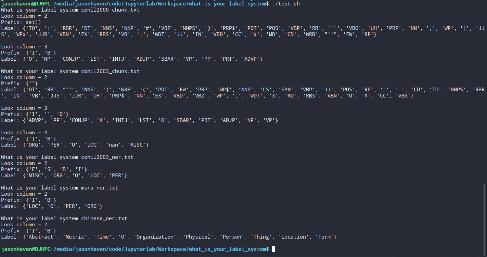

# what_is_your_label_system
A script for looking the label system of data for sequence tagging task such as NER, Chunking, POS et.

## Usage

1.Just copy the script to the data folder will be work.

2.Run command

```shell
python what_is_your_tag_system.py --file_path xxxx
```

## Result

