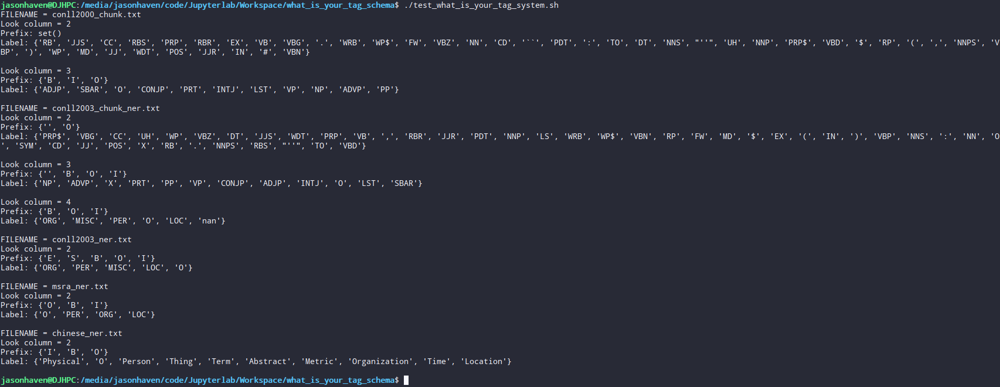
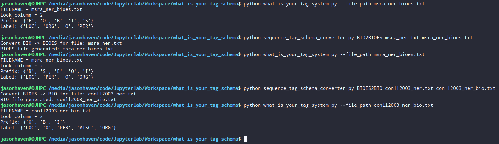

# what_is_your_tag_schema
A script for looking the label system of data for sequence tagging task such as NER, Chunking, POS et.

#### What is tag schema in sequence labeling tasks?

>标签是打在token上的。
>
>对于英文，token可以是一个单词（e.g. awesome），也可以是一个字符。
>
>对于中文，token可以是一个词语（分词后的结果），也可以是单个汉字字符。
>
> 标签列表如下：
>
>- B，即Begin，表示开始
>- I，即Intermediate，表示中间
>- E，即End，表示结尾
>- S，即Single，表示单个字符
>- O，即Other，表示其他，用于标记无关字符
>
>常用的较为流行的标签方案有如下几种：
>
>IOB1: 标签I用于文本块中的字符，标签O用于文本块之外的字符，标签B用于在该文本块前面接续则一个同类型的文本块情况下的第一个字符。
>
>IOB2: 每个文本块都以标签B开始，除此之外，跟IOB1一样。
>
>IOE1: 标签I用于独立文本块中，标签E仅用于同类型文本块连续的情况，假如有两个同类型的文本块，那么标签E会被打在第一个文本块的最后一个字符。
>
>IOE2: 每个文本块都以标签E结尾，无论该文本块有多少个字符，除此之外，跟IOE1一样。
>
>START/END （也叫SBEIO、IOBES）: 包含了全部的5种标签，文本块由单个字符组成的时候，使用S标签来表示，由一个以上的字符组成时，首字符总是使用B标签，尾字符总是使用E标签，中间的字符使用I标签。
>
>IO: 只使用I和O标签，显然，如果文本中有连续的同种类型实体的文本块，使用该标签方案不能够区分这种情况。

- 其中最常用的是IOB2、IOBS、IOBES。

## Usage

1.Just copy the script to the data folder will be work.

2.Run command

```shell
python what_is_your_tag_system.py --file_path xxxx
```

## Result

- what_is_your_tag_system.py

```shell
./test_what_is_your_tag_system.sh
```



- sequence_tag_schema_converter.py

  ```shell
  python sequence_tag_schema_converter.py IOB2BIO input_iob_file output_bio_file
  ```

  
